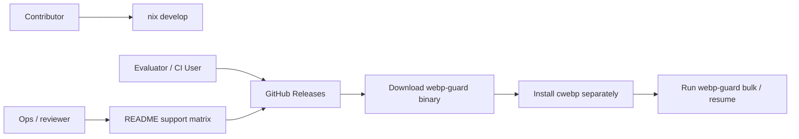

# Release Workflow And Installation Design

## 目的

この設計は、`webp-guard` を beta のままでも試しやすくし、導入時の迷いを減らすためのものです。

現状の課題は次です。

- GitHub Actions は検証中心で、配布導線がない
- 利用者は `nix develop` か `go build` を理解する必要がある
- `cwebp` が runtime 依存であることは正しいが、導入手順がまだ細い
- どの OS / install path をどこまで保証するのかが README から直感しづらい

目指すのは、機能を増やすことではなく、最初の一歩を軽くすることです。

## 設計方針

### 守ること

- beta の約束を広げすぎない
- 既存の `cwebp` 前提は維持する
- Nix は contributor 向けの再現性ある開発導線として残す
- 一般利用者には「Release binary を取る」経路を最短にする
- README だけ読めば導入と最初の実行まで行けるようにする

### 今回やらないこと

- `cwebp` の同梱
- Homebrew tap / winget / Scoop / apt repo の同時対応
- 署名基盤や SBOM の本格導入
- Docker を主導線にすること

`cwebp` 同梱や package manager 対応は将来の候補ですが、beta 初期で最も効くのは「release archive + 明確な Installation」です。

## 期待する利用導線



利用者を最初から 1 本の導線に押し込めず、役割ごとに自然な入口を用意します。

## 1. Release Workflow 設計

### 1-1. 新しい workflow の位置づけ

既存の [.github/workflows/optimize.yml](../.github/workflows/optimize.yml) は、PR / main 向けの validate workflow として維持します。

これとは別に、配布専用の `.github/workflows/release.yml` を追加します。

役割分担:

- `optimize.yml`: 変更の健全性確認
- `release.yml`: tag から release artifact を作って GitHub Releases に載せる

### 1-2. trigger

`release.yml` の trigger は次を想定します。

- `push.tags: ["v*.*.*"]`
- `workflow_dispatch`

Phase 1 では役割を次のように固定します。

- semver tag push: 正式な GitHub Release を作る
- `workflow_dispatch`: build / package / smoke test を手動で試す rehearsal 用に使う

`workflow_dispatch` では public release は作りません。
その代わり input で `version` を受け取り、archive 名と `-ldflags` に埋め込む version metadata にだけ使います。

### 1-3. release 対象

beta の最初の配布対象は次の 4 つに絞ります。

- `darwin-arm64`
- `darwin-amd64`
- `linux-amd64`
- `windows-amd64`

理由:

- macOS の Apple Silicon 利用者を最初から外さない
- Intel Mac と Windows の既存利用者も拾える
- Linux はまず `amd64` を Tier 1 にする
- 対応範囲を広げすぎず、README の support matrix を明快に保てる

`linux-arm64` は build-only 追加候補として backlog に置きます。

### 1-4. release artifact 構成

配布ファイル名は次の形に統一します。

```text
webp-guard_<version>_darwin_arm64.tar.gz
webp-guard_<version>_darwin_amd64.tar.gz
webp-guard_<version>_linux_amd64.tar.gz
webp-guard_<version>_windows_amd64.zip
webp-guard_<version>_checksums.txt
```

archive 内の構成:

```text
webp-guard[.exe]
LICENSE
README.md
INSTALL.md
```

ここでの `INSTALL.md` は release archive 向けの短い導線に限定します。
README 全文を読まなくても、

1. binary を PATH に置く
2. `cwebp` を入れる
3. `webp-guard help`
4. `webp-guard bulk --dir ... --dry-run`

まで到達できる内容にします。

### 1-5. version metadata

Release binary には version 情報を埋め込みます。

必要な最小項目:

- `version`
- `commit`
- `buildDate`

これに合わせて CLI に次のどちらかを追加します。

- `webp-guard version`
- `webp-guard --version`

beta では両対応にしてもよいですが、実装は `version` subcommand を正としておくほうが拡張しやすいです。

あわせて CLI の help 契約も固定します。

- `webp-guard help`
- `webp-guard -h`
- `webp-guard --help`
- `webp-guard <subcommand> -h`

これらはすべて usage を表示し、終了コード `0` を返すものとします。
release CI の smoke test でもこの契約をそのまま使います。

### 1-6. workflow の job 構成

#### Job A: Source Validate

目的:

- release 対象の tag が壊れていないことを確認する

内容:

- checkout
- Nix install
- `nix develop --command go test ./...`
- `nix develop --command go build -o webp-guard .`

この job が通らなければ配布に進みません。

#### Job B: Build And Package

目的:

- 各 OS 向け archive を生成する

内容:

- `actions/setup-go`
- matrix で `GOOS` / `GOARCH` を切り替え
- `CGO_ENABLED=0`
- `-ldflags` で version metadata を埋め込む
- UNIX 系は `.tar.gz`、Windows は `.zip`
- `sha256` checksum を生成

Nix を release build の唯一手段にしない理由は、配布 job では明快さと保守負荷の低さを優先するためです。
一方で source validation は Nix 経由で通すので、開発環境の正本は崩しません。

#### Job C: Native Smoke Test

目的:

- 少なくとも各 OS で binary が起動し、基本コマンドが動くことを確認する

対象:

- Linux runner
- macOS runner
- Windows runner

macOS の native smoke は `darwin-arm64` を正本にします。
`darwin-amd64` は Phase 1 では build/package までを保証し、native 実行確認は後続対応に置きます。

内容:

- 生成済み artifact を取得
- `webp-guard help`
- `webp-guard version`
- `webp-guard scan -h`
- `webp-guard plan -h`

ここでは `cwebp` が不要なコマンドだけを使います。
配布直後に「起動しない」事故を防ぐことが主目的です。

#### Job D: Publish Release

目的:

- GitHub Release を作成し、artifact を添付する

内容:

- draft / prerelease の切り替え
- archive と checksum の upload
- release notes の定型文反映

release notes の冒頭には、必ず次を含めます。

- 対応 OS
- `cwebp` が別途必要なこと
- Installation セクションへのリンク

### 1-7. release notes の最小テンプレート

毎回長文を書くより、一定の型に寄せます。

```text
## Highlights
- ...

## Installation
- Download the archive for your OS
- Install cwebp separately
- Run `webp-guard version`

## Support
- Tier 1: macOS arm64/amd64, Linux amd64, Windows amd64
- cwebp is required for bulk and resume when not using -dry-run
```

### 1-8. acceptance criteria

release workflow の完了条件は次です。

- semver tag から 4 種類の archive が生成される
- checksum が同時に生成される
- Linux / macOS(`darwin-arm64`) / Windows で smoke test が通る
- release notes に install 導線が出る
- 利用者が Go や Nix を知らなくても binary を試せる

## 2. Installation 強化の設計

### 2-1. README の再構成

[README.md](../README.md) と [README_EN.md](../README_EN.md) に `Installation` セクションを新設します。

順番は次を推奨します。

1. 概要
2. Installation
3. Quick Start
4. Commands
5. Security / Artifacts / Development

今は機能説明が先に来ていて、理解はしやすい一方で「まず試す」人には入り口が少し遠いです。

### 2-2. Installation セクションの構成

README の `Installation` は 3 レーンに分けます。

#### A. Release Binary

対象:

- 一番多い利用者
- まず試したい人
- CI にすぐ入れたい人

内容:

- Releases から archive を取る
- binary を PATH に置く
- `cwebp` を入れる
- `webp-guard version`

README 上ではこれを `Recommended` にします。

#### B. Go Install

対象:

- Go 利用者
- 自分の PATH と toolchain を自前で管理したい人

内容:

- `go install github.com/mt4110/webp-guard@latest`
- 別途 `cwebp` が必要

#### C. Nix

対象:

- contributor
- 再現性重視の開発者

内容:

- `nix develop`
- `go test ./...`
- `go build -o webp-guard .`

### 2-3. runtime dependency の明文化

`cwebp` 依存は弱点というより、明示不足が friction です。
README では次のようにコマンド単位で書き分けます。

| コマンド | `cwebp` 必須か |
| --- | --- |
| `scan` | 不要 |
| `verify` | 不要 |
| `plan` | 不要 |
| `publish` | 不要 |
| `verify-delivery` | 不要 |
| `bulk` | `-dry-run` 以外では必要 |
| `resume` | `-dry-run` 以外では必要 |

この表があるだけで、導入時の心理的負担がかなり減ります。

### 2-4. OS 別 install ガイドの方針

README には「各 OS で 1 つだけ、確認済みの install path」を載せます。

原則:

- macOS: Homebrew の 1 経路
- Ubuntu/Debian: `apt` の 1 経路
- Windows: 1 つの公式または標準的な経路

ここで重要なのは選択肢を増やすことではなく、「まずこれで通る」を 1 本示すことです。

Windows は package ID や配布元の揺れが起きやすいので、README へ反映する install コマンドは実装時点で実機確認したものだけを載せます。

### 2-5. Quick Start の新しい形

README には install 直後の最短例を置きます。

```bash
webp-guard scan --dir ./assets --report ./out/scan.jsonl

webp-guard bulk \
  --dir ./assets \
  --out-dir ./out/assets \
  --dry-run \
  --report ./out/bulk-plan.jsonl
```

最初の例は、`cwebp` が未導入でも動く `scan` を先に置きます。
次に `bulk -dry-run` を置き、最後に本変換へ進めます。

### 2-6. install 後の自己診断

Installation 強化の次段として、CLI には軽量な自己診断導線を入れる価値があります。

候補:

- `webp-guard version`
- `webp-guard doctor`

ただし今回の first step では `version` を必須、`doctor` は後続候補に留めます。

`doctor` で将来的に見たいもの:

- `webp-guard` binary version
- `cwebp` の存在確認
- `cwebp` version
- PATH 上の解決結果

### 2-7. CI / automation 向け install 文言

README の install 説明とは別に、release notes と docs には CI 向けの短い導線を置きます。

主旨:

- CI では release archive を取得して PATH に置く
- `cwebp` は runner の package manager で入れる
- contributor 向けの `nix develop` と混同させない

これにより「開発用の Nix 導線」と「利用者の install 導線」がきれいに分かれます。

## 3. 具体的な変更対象

実装時に触る主なファイル:

- `.github/workflows/release.yml` を追加
- `README.md` に `Installation` と support matrix を追加
- `README_EN.md` に対応する英語版を追加
- `main.go` / `cli.go` に version 表示を追加
- release archive 向けの `INSTALL.md` テンプレートを追加

必要なら後続で次も検討します。

- `scripts/install.sh`
- `scripts/install.ps1`
- `doctor` subcommand

## 4. 段階的 rollout

### Phase 1

- release workflow
- 4 target archive
- checksum
- `version` command
- README の Installation 再編

### Phase 2

- Windows install 導線の磨き込み
- `linux-arm64` の追加検討
- 軽量 install script

### Phase 3

- `doctor` subcommand
- package manager 配布
- Docker image

## 5. この設計で得られること

- beta の約束を壊さずに試しやすくなる
- `cwebp` 依存を隠さず、それでも導入で迷いにくくなる
- Nix は contributor 体験として残しつつ、一般利用者は binary download で始められる
- Release と Installation が別々の話ではなく、1 本の導線としてつながる

この段階では、派手な配布網より「一度触った人が次も迷わないこと」を優先します。
